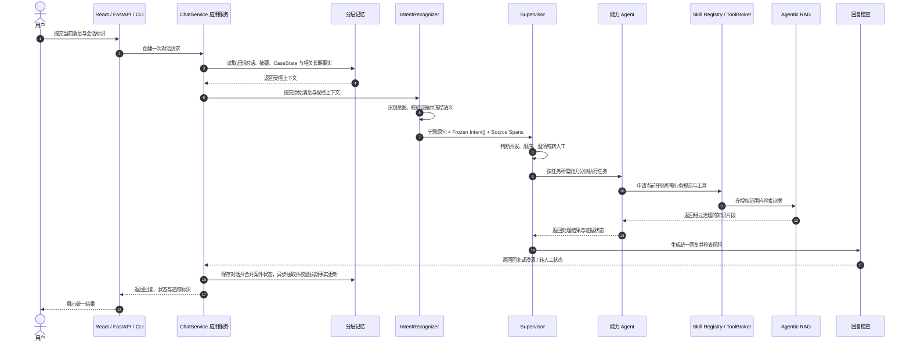

<div align="center">
  <h2>TokenPlan 订阅服务智能体</h2>

  <p>
    <a href="https://github.com/Tassel9/TokenPlan/stargazers"></a>
    
    
    
    
    
  </p>

  <p>面向 AI Coding 订阅用户的 <strong>Supervisor Multi-Agent</strong> 客服系统。</p>
  <p>在一个对话入口中理解复合诉求，协调能力 Agent、业务规范与知识库，并生成一份统一回复。</p>
</div>

## 项目解决什么问题

订阅客服请求通常不是一个孤立的分类问题：用户可能在同一条消息里同时咨询套餐和扣款，也可能用“第二个”“还是刚才那笔”延续前文；回答依据又分散在套餐规则、账单政策和技术文档中。TokenPlan 将这些问题收敛到一条可追踪的处理链路：

- 理解一条消息中仍然成立的多个诉求，并区分否定、举例和背景描述。
- 按任务所需能力把知识检索、业务数据核验等分派给对应能力 Agent，统一组织处理结果。
- 从受治理的业务知识中检索回答依据，证据不足时澄清或转人工，而不是补造结论。
- 延续近期对话、案件状态和稳定用户信息，支持跨轮指代与处理进度衔接。
- 限制每个任务可加载的业务规范和工具范围，保留执行记录便于排查。

当前公开版本主要覆盖套餐与权益咨询、规则解释、账户安全指引、账单流程说明和技术排障。实际账单核验、退款提交、账户修改等依赖业务后台的操作会明确转人工，不会宣称已经执行。

## 项目预览

**复合客服问题输入**


用户可以直接描述套餐、账单、权益或技术问题，也可以在一条消息中同时提出多个诉求，不需要预先选择业务入口。

**多诉求协作与统一回复**


系统将成立的诉求交给对应能力 Agent 处理，再汇总成一份连贯答复。

**多轮上下文追问**


用户可以沿用“第二个”“这两笔扣款”等表达继续追问，系统结合已有对话和案件状态理解当前所指对象。

## 请求处理主线



独立诉求可以在同一阶段并发处理并等待收敛后汇总；存在前后依赖时按阶段推进。关键前置步骤失败后，下游依赖任务不会继续执行，系统转为澄清或人工处理，并在执行记录中保留本阶段结果。

## 核心能力

订阅客服场景天然是复合诉求、多轮指代、规则分散且操作敏感的。TokenPlan 的能力设计围绕这一背景展开，可以概括为六个方面。

### 🧭 多意图识别（语义召回 + 意图树）

先识别、后调度：候选意图经语义召回与意图树推理收敛成冻结的意图集合，调度只消费、不重判。

- 冻结语义 — IntentRecognizer 以语义召回 + 意图树推理独立完成上下文消解、产品范围判断、多意图识别、原文证据提取和置信度门控，输出不可变的意图集合。
- 证据可追溯 — 每个意图携带用户原句中的 `source_spans`；同时保留完整原句，让 Supervisor 能判断“先……再……”等跨意图关系。
- 单向边界 — Supervisor 只能基于冻结结果决定并发、顺序、澄清、兜底或转人工，不能新增、删除或改写意图标签。

### 🔍 混合检索与查询改写

先取证、再作答：关键词与向量双路召回共同给出依据，口语化查询由 Agent 改写重试，证据冲突或过期时保留不确定性。

- 混合检索 — 能力 Agent 结合 BM25 关键词检索与向量语义检索寻找业务依据，对多路结果进行融合和排序。
- 查询改写与补搜 — 口语化或覆盖不足的查询由 Agent 判断后改写并重试检索，补搜次数有上限。
- 证据边界 — 知识冲突、过期或证据不足时，回复会保留不确定性并给出下一步处理方式。

### 🧠 分层记忆

基于 SQLite 与 ChromaDB 的分层记忆：短期会话与长期事实分开存放，上下文受 Token 预算约束，记下的事实保证用得上、不过期。

- 三存储分工 — SQLite 保存近期消息、增量摘要和当前案件状态，ChromaDB 保存可跨会话复用的稳定用户事实，RabbitMQ 承接长期事实更新任务；业务进度留在 CaseState，稳定偏好留在长期事实，避免把易变化状态误当成用户画像。
- 摘要不留缺口 — 近期对话视图按 Token 预算保留全部未摘要轮次，滑出预算的轮次在同一次压缩中并入增量摘要，保证摘要与最近对话之间没有覆盖缺口。
- 会话一次写 — 同一会话由 SQLite 事务和轮次号保护：子 Agent 按任务 ID 登记独立结果，服务层汇总后一次写入消息和 `CaseState`；当前 Compose 只运行一个应用实例，会话文件持久化到 `./data/session`，旧会话数据不会自动导入这个新文件。
- 事件式长期事实 — 按“单次抽取 → 服务端校验 → 追加事件 → 读取时归并”更新：模型只提出候选，逐字证据与敏感信息校验通过后才写入，历史值不被覆盖；读取时把事件回放成当前有效画像，撤回与过期都不会回退到旧值。
- 注入不留漏检 — 默认全量注入全部当前有效非全局事实（闭集 ≤3 条，与查询无关），把“记住了却没用上”的语义召回漏检降为零。
- 指代消解有边界 — 抽取可附带同会话最近的用户发言消解指代（如“以后就用它了”），但跨轮证据只允许变更或撤回、且操作措辞必须出现在当前消息；助手措辞永远不能成为事实证据。

### 🤝 多 Agent 编排（Supervisor + 能力 Agent）

Supervisor 只做分派与收口、执行交给能力 Agent：每个任务只带自己的能力与规范，结果统一回传汇总。

- 能力型分工 — 按任务所需能力分派给知识检索、结构化查询与业务办理三类能力 Agent，单智能体不再背负全部职责与提示词。
- 并发与依赖 — 独立诉求可在同一阶段并发处理并等待收敛后汇总；存在前后依赖时按阶段推进。
- 统一收口 — 关键前置步骤失败后，下游依赖任务不会继续执行，系统转为澄清或人工处理，并在执行记录中保留本阶段结果。

### 🧰 Skill Registry 与渐进式披露

Skill Registry 管理业务 SOP：技能先校验归属，内容渐进式披露，工具按任务绑定。

- 业务 SOP 治理 — Skill Registry 根据 Supervisor 已确认的诉求选择当前能力 Agent 对应的业务技能，并校验 Agent 与技能的归属关系。
- 渐进式披露 — 提示词只注入技能核心契约与资源目录描述符，资源正文按需读取，减少全量注入导致的注意力涣散。
- 任务级工具边界 — ToolBroker 按任务能力创建本次执行可用的工具边界。

### 🛡️ 安全兜底与可观测性

回复在发出前先过一次安全检查，执行过程全链路留痕。

- 回复安全检查 — 最终回复经过安全检查，避免把失败的检索或未执行的操作描述为成功。
- 全链路留痕 — Execution Trace 与 Prometheus 指标记录请求阶段、Agent 执行、工具调用和兜底状态，便于定位问题。

## 组件职责

| 组件 | 职责 |
| :--- | :--- |
| React 工作台 | 提交问题并展示回复、处理状态与证据摘要 |
| FastAPI / CLI | 负责传输协议、请求校验和入口级保护 |
| ChatService | 统一 HTTP 与 CLI 的单轮应用流程，负责上下文读取、编排调用、状态合并和记忆写入 |
| IntentRecognizer | 完成上下文消解、范围判断、多意图识别、原文证据提取与置信度门控，输出冻结语义 |
| Supervisor | 消费冻结意图与完整原句，决定阶段并发、依赖顺序、澄清、转人工和最终汇总，不得重新识别意图 |
| 能力 Agent | 按任务所需能力分为知识检索、结构化查询与业务办理 |
| Skill Registry / ToolBroker | 管理业务规范、授权边界与任务级工具绑定 |
| Agentic RAG | 提供混合检索、结果排序、证据治理和有限补充检索 |
| 分层记忆 | 维护近期对话、摘要、CaseState 与长期稳定事实 |
| Response Guard / Trace | 检查最终回复并记录可诊断的执行过程 |

## 评测与证据边界

`tests/` 与 `evaluation/` 用于代码回归和冻结业务用例上的离线验证。离线结果只说明指定代码、配置、模型和数据集下的表现，不代表线上生产效果、服务等级或真实用户流量结论。

本 README 不发布评测分数，也不把历史或其他业务领域的数据当作 TokenPlan 成绩。对外结论应能够追溯到当前 TokenPlan 业务用例、评测配置和生成报告；生产表现需要独立的线上观测证据。

## 技术栈

| 层次 | 技术 | 用途 |
| :--- | :--- | :--- |
| 应用与接口 | Python 3.12、FastAPI、Pydantic、AsyncIO | 应用服务、接口和运行时数据契约 |
| 模型 | DeepSeek、BGE Embedding、BGE Reranker | 语义理解、向量表示与知识排序 |
| Agent 协作 | IntentRecognizer、Supervisor、能力 Agent、Skill Registry、ToolBroker | 冻结语义、任务分派、能力治理与结果汇总 |
| 检索 | ChromaDB、SQLite FTS5 | 向量与关键词混合检索 |
| 记忆与异步任务 | SQLite、ChromaDB、RabbitMQ | 会话状态、长期事实与异步更新 |
| 前端 | React、TypeScript、Vite | 会话工作台与状态展示 |
| 可观测性 | Prometheus、Execution Trace | 运行指标与执行过程记录 |
| 部署 | Docker、Docker Compose、Nginx | 服务编排、健康检查与反向代理 |

## 本地运行

### 环境要求

| 组件 | 要求 | 说明 |
| :--- | :--- | :--- |
| Python | 3.12 | 后端运行环境 |
| Node.js | 22+ | 前端开发与构建 |
| Docker | Compose v2 | 启动 RabbitMQ、ChromaDB 等依赖 |
| DeepSeek API | 可用 Key | LLM 调用 |

### 1. 准备配置

```powershell
Copy-Item .env.example .env
```

**只有 `DEEPSEEK_API_KEY` 是必填项**，其余变量全部有代码默认值；`.env.example` 里另有一组"本地运行"地址（指向宿主机），容器跑法会被 Compose 覆盖。完整变量清单与默认值见 [docs/configuration.md](docs/configuration.md)。

编辑 `.env` 并设置 `DEEPSEEK_API_KEY`。部署前应替换示例密码；密钥只保存在本地 `.env`，不要提交到仓库。

填完先跑一次配置自检（不构造服务、只读取环境变量并探测端口，依赖未启动时也能运行）：

```powershell
.\.venv-win\Scripts\python.exe backend\cli.py doctor
```

输出 `ok` / `degraded` / `blocked` 三种结论并给出修复建议；`blocked` 时退出码为 1，可直接用于启动脚本。

运行方式不同，基础设施地址也不同：

- **完整 Docker Compose**：Compose 会为应用容器覆盖 RabbitMQ 和 ChromaDB 的容器内地址，并将 SQLite 会话文件保存在 `./data/session`。
- **本地 Python + Docker 基础设施**：Python 进程从宿主机访问 RabbitMQ 和 ChromaDB，SQLite 会话文件由 `SESSION_DB_PATH` 指定。

升级已有数据卷时，TokenPlan 默认会使用新的项目专属知识库集合和 FTS 索引。若要继续读取旧索引，请在启动前通过 `RAG_CHROMA_COLLECTION_NAME` 与 `RAG_LEXICAL_INDEX_PATH` 显式指向原集合和文件，核对数据后再安排迁移。

### 2. 完整 Docker Compose 启动

```powershell
docker compose up --build -d
docker compose ps
Invoke-RestMethod http://localhost:8000/health
```

API 文档默认位于 `http://localhost:8000/docs`，Nginx 入口默认位于 `http://localhost`。

### 3. 本地 Python 启动

先启动基础设施：

```powershell
docker compose up -d rabbitmq chromadb
```

确认 `.env` 使用宿主机可访问的 RabbitMQ 和 ChromaDB 地址，并保证连接凭据与 Compose 配置一致。然后启动后端：

```powershell
python -m venv .venv-win
.\.venv-win\Scripts\Activate.ps1
pip install -r requirements\base.txt
python -m uvicorn --app-dir backend api.main:app --host 0.0.0.0 --port 8000
```

另开终端发送一条多诉求请求：

```powershell
.\.venv-win\Scripts\python.exe backend\cli.py "插件一直报 401，而且这个月重复扣款了"
```

CLI 用于本地单进程调试；HTTP 接口通过 SQLite 会话锁防止同一会话并发提交。

### 4. 启动前端

后端启动后，另开一个终端：

```powershell
Set-Location frontend
npm ci
npm run dev
```

浏览器访问 `http://127.0.0.1:5173`。开发服务器会把 `/api` 请求代理到 `http://127.0.0.1:8000`；详细配置见 [frontend/README.md](frontend/README.md)。

## 目录结构

```text
TokenPlan
├── backend/      # Python 后端源码
│   ├── application/、agents/、core/   # 应用编排、Supervisor 与语义识别
│   ├── runtime/、response/、skills/   # 受控执行、回复治理与业务 SOP
│   ├── mcp/、memory/                  # 工具、知识检索与分层记忆
│   └── api/、monitor/、tools/         # 接口、可观测性与通用扩展
├── evaluation/   # 离线评测工具与冻结用例
├── tests/        # 自动化测试
└── frontend/     # React 会话工作台
```

后端子模块职责见 [`backend/README.md`](backend/README.md)。
