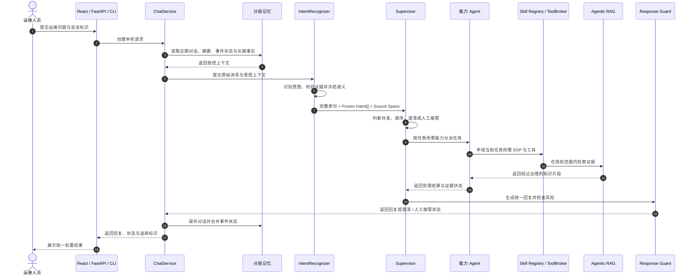

<div align="center">
  <h2>UrbanOps 市政运维智能体</h2>

  <p>
    <a href="https://github.com/Tassel9/UrbanOps/stargazers"></a>
    
    
    
    
    
  </p>

  <p>面向市政设施巡检、故障处置与工单协同的 <strong>Supervisor Multi-Agent</strong> 运维系统。</p>
  <p>在一个对话入口中理解复合运维诉求，协调能力 Agent、运维规范与设施知识，并生成统一处置建议。</p>
</div>

## 项目定位

UrbanOps 是面向日常实习与技术面试的 Agent 工程项目，不以复刻完整市政信息化平台为目标。项目重点是多意图识别、Supervisor 编排、能力级 Tool 授权、Agentic RAG、分层记忆和可追踪执行链路。

## 项目解决什么问题

市政运维请求通常包含多个相互关联的任务：运维人员可能在同一条消息里查询设备状态、询问排障步骤并要求创建工单，也可能用“刚才那台泵”“第二个点位”延续前文。相关依据又分散在设备手册、巡检规范、应急预案和历史处置记录中。UrbanOps 将这些问题收敛到一条可追踪的处理链路：

- 识别一条消息中仍然成立的多个运维诉求，并区分否定、举例和背景描述。
- 按任务所需能力分派知识检索、设施数据查询与工单操作，统一组织处理结果。
- 从受治理的运维知识中检索依据；证据不足时主动澄清或转人工值守。
- 延续近期对话、事件状态和稳定设施信息，支持跨轮指代与处置进度衔接。
- 限制每个任务可加载的 SOP 和工具范围，保留执行记录便于复盘与审计。

当前公开版本完成了对话编排、知识检索、分层记忆、能力授权和执行追踪。真实设备遥测、GIS、巡检和工单平台仍需通过受控适配器接入；缺少业务回执时，系统只提供规范与处置建议，不会宣称工单或设备操作已经完成。

## 工作台能力

Web 工作台提供设备巡检、故障排查、工单跟进和应急处置等快捷入口。用户可以在一条消息中同时提出多个诉求，并查看识别结果、参与处理的能力 Agent、知识证据和执行状态。

典型输入示例：

> 泵站 P-102 出现高温告警，请先查询最近巡检记录，再给出排查步骤并生成维修工单。

对于存在依赖关系的任务，系统先查询设备与巡检信息，再依据查询结果组织排障和工单请求；关键前置步骤失败后，下游任务停止执行并转为澄清或人工处理。

## 请求处理主线



独立诉求可以在同一阶段并发处理并等待收敛后汇总；存在前后依赖时按阶段推进。执行记录保留每个阶段的状态、证据和失败原因。

## 核心能力

### 多意图识别

候选意图经语义召回与意图树推理收敛成冻结意图集合，调度层只消费结果，不在执行阶段重新解释用户诉求。

- IntentRecognizer 完成上下文消解、业务范围判断、多意图识别、原文证据提取和置信度门控。
- 每个意图携带用户原句中的 `source_spans`，Supervisor 可据此判断“先查询、再处理”等跨任务关系。
- 低置信度或关键信息缺失时进入澄清流程，避免直接触发敏感操作。

### 运维知识检索

BM25 关键词检索与向量语义检索共同召回设备手册、巡检规范、故障案例和应急预案，口语化查询可以在受控次数内改写补搜。

- 检索结果经过融合、排序和证据范围校验。
- 文档版本、适用设施和生效时间参与知识治理。
- 证据冲突、过期或覆盖不足时保留不确定性并给出下一步核验方式。

### 分层记忆

SQLite 保存近期消息、增量摘要和当前事件状态，ChromaDB 保存可跨会话复用的稳定事实，RabbitMQ 承接长期事实更新任务。

- 最近完整对话与历史摘要共同受 Token 预算约束。
- 设备编号、点位、当前工单和已完成步骤进入事件状态，避免多轮处理中反复询问。
- 长期事实以“候选抽取、证据校验、追加事件、读取归并”的方式更新，支持撤回、替换与过期。

### Supervisor 与能力 Agent

Supervisor 负责阶段规划、能力分派和结果收口；知识检索、结构化查询与业务办理分别由对应能力 Agent 执行。

- 设备知识与规范问题交给知识检索能力。
- 设施状态、巡检记录和工单进度交给只读数据查询能力。
- 创建、派发或更新工单等写操作交给业务办理能力，并要求审批标识与幂等键。
- 没有真实业务回执时，结果只能标记为待人工接管或待外部系统确认。

### Skill 与工具治理

Skill Registry 管理巡检、排障、工单和应急处置 SOP；ToolBroker 根据任务能力创建本次执行可用的工具边界。

- Skill 在加载前校验归属、版本和资源权限。
- 提示词只注入必要契约，详细资源按需读取。
- 写操作经过参数校验、权限检查、用户确认、幂等控制和审计记录。

### 安全与可观测性

Response Guard 检查最终回复，避免把未执行的设备控制或工单操作描述为成功。Execution Trace 与 Prometheus 指标记录请求阶段、Agent 执行、工具调用和兜底状态。

## 组件职责

| 组件 | 职责 |
| :--- | :--- |
| React 运维工作台 | 提交问题并展示回复、处理状态与证据摘要 |
| FastAPI / CLI | 请求校验、协议适配和入口级保护 |
| ChatService | 读取上下文、调用编排、合并状态并写入记忆 |
| IntentRecognizer | 上下文消解、范围判断、多意图识别与证据提取 |
| Supervisor | 决定并发、依赖顺序、澄清、人工接管和结果汇总 |
| 能力 Agent | 执行知识检索、结构化查询与业务办理任务 |
| Skill Registry / ToolBroker | 管理运维 SOP、授权边界与任务级工具绑定 |
| Agentic RAG | 混合检索、结果排序、证据治理和有限补充检索 |
| 分层记忆 | 维护近期对话、摘要、事件状态与长期稳定事实 |
| Response Guard / Trace | 检查最终回复并记录可诊断的执行过程 |

## 评测与证据边界

`tests/` 与 `evaluation/` 用于代码回归和冻结用例上的离线验证。当前仓库中的历史评测数据不能直接代表市政运维场景的效果；完成市政数据集、真实接口和同配置评测后，才能发布 UrbanOps 的意图识别、检索质量、告警准确率或端到端处理指标。

当前统一端到端入口是 `evaluation/live_eval/run_suite.py`：以版本化 YAML 场景驱动真实
`ChatService`，每个样本隔离存储，联合检查答案、路由、工具、证据、Trace 与安全边界，并同时
报告样本通过率和多次重复的稳定通过率。详细口径与命令见
[`evaluation/live_eval/README.md`](evaluation/live_eval/README.md)。历史 `evaluation/benchmarks/`
脚本继续用于局部机制实验与旧报告复现，不能与当前 Live Eval 指标混用。

## 技术栈

| 层次 | 技术 | 用途 |
| :--- | :--- | :--- |
| 应用与接口 | Python 3.12、FastAPI、Pydantic、AsyncIO | 应用服务、接口与运行时契约 |
| 模型 | DeepSeek、BGE Embedding、BGE Reranker | 语义理解、向量表示与知识排序 |
| Agent 协作 | IntentRecognizer、Supervisor、能力 Agent、Skill Registry、ToolBroker | 任务识别、能力分派与结果汇总 |
| 检索 | ChromaDB、SQLite FTS5 | 向量与关键词混合检索 |
| 记忆与异步任务 | SQLite、ChromaDB、RabbitMQ | 会话状态、长期事实与异步更新 |
| 前端 | React、TypeScript、Vite | 市政运维会话工作台 |
| 可观测性 | Prometheus、Execution Trace | 运行指标与执行过程记录 |
| 部署 | Docker、Docker Compose、Nginx | 服务编排、健康检查与反向代理 |

## 本地运行

### 环境要求

| 组件 | 要求 |
| :--- | :--- |
| Python | 3.12 |
| Node.js | 22+ |
| Docker | Compose v2 |
| DeepSeek API | 可用 Key |

### 1. 准备配置

```powershell
Copy-Item .env.example .env
```

编辑 `.env` 并设置 `DEEPSEEK_API_KEY`。密钥只保存在本地，不要提交到仓库。配置完成后运行自检：

```powershell
.\.venv-win\Scripts\python.exe -m cli doctor
```

### 2. 使用 Docker Compose 启动

```powershell
docker compose up --build -d
docker compose ps
Invoke-RestMethod http://localhost:8000/health
```

API 文档位于 `http://localhost:8000/docs`，Nginx 入口默认位于 `http://localhost`。

### 3. 本地启动后端

```powershell
docker compose up -d rabbitmq chromadb
python -m venv .venv-win
.\.venv-win\Scripts\Activate.ps1
pip install -r requirements/base.txt
python -m uvicorn --app-dir backend api.main:app --host 0.0.0.0 --port 8000
```

另开终端发送一条复合运维请求：

```powershell
.\.venv-win\Scripts\python.exe backend/cli.py "泵站 P-102 出现高温告警，请查询巡检记录并给出排查步骤"
```

### 4. 启动前端

```powershell
Set-Location frontend
npm ci
npm run dev
```

浏览器访问 `http://127.0.0.1:5173`。开发服务器默认将 `/api` 代理到 `http://127.0.0.1:8000`。

## 目录结构

```text
├── backend/       # Python 后端源码
│   ├── api/       # FastAPI 入口
│   ├── application/、agents/、core/   # 应用编排与 Agent 决策
│   ├── runtime/、response/、skills/   # 受控执行、回复治理与 SOP
│   ├── mcp/、memory/                  # 工具/知识集成与记忆
│   └── monitor/、tools/               # 可观测性与通用扩展
├── frontend/      # React 运维工作台
├── evaluation/    # 统一评测、基准脚本、冻结用例与报告
├── tests/         # 自动化测试
├── docs/          # 架构、配置和性能文档
├── config/        # Nginx、Prometheus 等部署配置
├── requirements/  # 分层 Python 依赖
└── scripts/       # 构建与部署脚本
```

后端子模块的职责边界见 [`backend/README.md`](backend/README.md)。本地缓存、虚拟环境、
运行数据和日志仍保留在原位置，但通过仓库的 VS Code 配置默认隐藏，避免干扰源码浏览。
