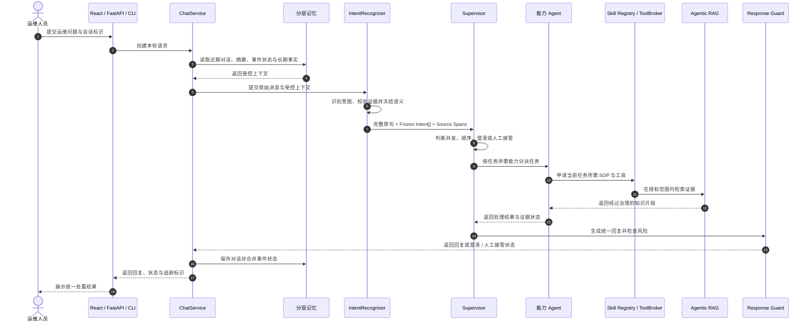

<div align="center">
  <h2>UrbanOps 市政运维智能体</h2>

  <p>
    <a href="https://github.com/Tassel9/UrbanOps/stargazers"></a>
    
    
    
    
    
  </p>

  <p>面向智慧路灯巡检、告警处置与维修工单协同的 <strong>Supervisor Multi-Agent</strong> 运维系统。</p>
  <p>系统中的现场终端就是智慧路灯；一个对话入口可协调知识检索、结构化查询与业务办理，并生成统一处置结果。</p>
</div>

## 核心功能

市政运维请求往往同时包含路灯状态查询、规范检索、故障排查和工单操作，并通过“刚才那盏灯”“第二个点位”等指代延续前文。UrbanOps 围绕这类复合请求构建了四层能力。

### 🧭 多意图路由与 Supervisor 协同

> 一次识别一条消息中的多个有效诉求，再根据任务依赖决定并发、串行、澄清或人工接管。

- **多意图识别** — 结合语义召回与意图树推理识别路灯查询、巡检规范、故障排查和工单操作，并保留原文 `source_spans`。
- **依赖编排** — 独立任务并发执行；“先查询、再处理”一类任务按阶段推进，前置失败时停止下游操作。
- **置信度门控** — 对否定、举例、范围外请求和信息缺失进行校验，低置信度结果不会直接触发敏感工具。
- **统一收口** — Supervisor 汇总各能力 Agent 的结果、证据和失败原因，生成一份连贯回复。

### 🔍 有证据约束的 Agentic RAG

> 从路灯控制器手册、巡检规范、故障案例和应急预案中检索依据，并让结论能够回到具体证据。

- **混合检索** — SQLite FTS5 关键词检索与 ChromaDB 向量检索共同召回候选片段，再执行融合与排序。
- **有限补搜** — 口语化或信息不足的查询可以在受控次数内改写重试，避免无边界循环。
- **知识治理** — 文档版本、适用设施和生效时间参与过滤；冲突、过期或覆盖不足时保留不确定性。
- **回复校验** — Response Guard 阻止系统把知识建议描述为已经完成的现场操作或工单结果。

### 🧠 分层记忆与多轮处置

> 在 Token 预算内保留近期对话与当前事件状态，让后续问题能够承接上一轮处理进度。

- **短期上下文** — SQLite 保存近期消息和增量摘要，完整对话与历史摘要共同受 Token 预算约束。
- **事件状态** — 路灯编号、点位、当前工单和已完成步骤进入会话状态，用于解析跨轮指代。
- **长期事实** — ChromaDB 保存可跨会话复用的稳定事实，RabbitMQ 承接异步更新任务。
- **事实演进** — 长期事实支持追加、替换、撤回和过期，读取时归并为当前有效状态。

### 🛡️ 能力授权与可追踪执行

> 每个 Agent 只获得当前任务需要的 SOP 和工具，写操作经过校验并留下完整执行记录。

- **能力绑定** — Skill Registry 管理巡检、排障和工单 SOP，ToolBroker 为任务生成最小工具集合。
- **读写隔离** — 知识检索、设施查询和业务办理由不同能力 Agent 执行，写操作要求权限、确认和幂等控制。
- **本地业务适配** — 仓库内置 SQLite 业务后端用于设施、工单和操作申请的可复现验证，真实平台可按相同工具契约接入。
- **执行追踪** — Trace 与 Prometheus 记录请求阶段、Agent 状态、工具事件、证据和兜底路径。

## 系统流程



独立诉求可以在同一阶段并发处理并等待收敛后汇总；存在前后依赖时按阶段推进。执行记录保留每个阶段的状态、证据和失败原因。

## 评测

[`evaluation/live_eval/`](evaluation/live_eval/) 是当前统一的端到端评测入口。版本化 YAML 场景覆盖路由、检索、记忆、协同和安全五类行为，并通过真实 `ChatService` 执行完整多轮链路。

- 每个 `scenario × run` 使用隔离的会话、Trace 和向量存储，避免样本之间相互污染。
- 同时检查答案、意图、Agent、工具调用、证据与 Trace，规则失败不能被 LLM Judge 覆盖。
- 重复运行时同时报告样本通过率与稳定通过率；只有同一场景全部通过才计为稳定通过。
- `evaluation/benchmarks/` 保留检索、意图和记忆的专项实验，用于解释局部机制表现。

```powershell
$py = ".\.venv-win\Scripts\python.exe"

# 校验评测场景，不调用模型
& $py evaluation\live_eval\run_suite.py --dry-run --tier smoke

# 执行快速端到端套件
& $py evaluation\live_eval\run_suite.py --tier smoke --runs 3

# 运行代码回归
& $py -m pytest -q
```

场景格式、基线比较和报告口径见 [`evaluation/live_eval/README.md`](evaluation/live_eval/README.md)。

## 技术栈

| 层次 | 技术 | 用途 |
| :--- | :--- | :--- |
| 应用与接口 | Python 3.12、FastAPI、Pydantic、AsyncIO | 应用服务、接口与运行时契约 |
| 模型 | DeepSeek、BGE Embedding、BGE Reranker | 语义理解、向量表示与知识排序 |
| Agent 协作 | IntentRecognizer、Supervisor、能力 Agent、Skill Registry、ToolBroker | 任务识别、能力分派与结果汇总 |
| 检索 | ChromaDB、SQLite FTS5 | 向量与关键词混合检索 |
| 记忆与异步任务 | SQLite、ChromaDB、RabbitMQ | 会话状态、长期事实与异步更新 |
| 前端 | React、TypeScript、Vite | 市政运维会话工作台 |
| 可观测性 | Prometheus、Execution Trace | 运行指标与执行过程记录 |
| 部署 | Docker、Docker Compose、Nginx | 服务编排、健康检查与反向代理 |

## 本地运行

### 环境要求

| 组件 | 要求 |
| :--- | :--- |
| Python | 3.12 |
| Node.js | 22+ |
| Docker | Compose v2 |
| DeepSeek API | 可用 Key |

### 1. 准备配置

```powershell
Copy-Item .env.example .env
```

编辑 `.env` 并设置 `DEEPSEEK_API_KEY`。密钥只保存在本地，不要提交到仓库。配置完成后运行自检：

```powershell
.\.venv-win\Scripts\python.exe backend/cli.py doctor
```

### 2. 使用 Docker Compose 启动

```powershell
docker compose up --build -d
docker compose ps
Invoke-RestMethod http://localhost:8000/health
```

API 文档位于 `http://localhost:8000/docs`，Nginx 入口默认位于 `http://localhost`。

### 3. 本地启动后端

```powershell
docker compose up -d rabbitmq chromadb
python -m venv .venv-win
.\.venv-win\Scripts\Activate.ps1
pip install -r requirements/base.txt
python -m uvicorn --app-dir backend api.main:app --host 0.0.0.0 --port 8000
```

另开终端发送一条复合运维请求：

```powershell
.\.venv-win\Scripts\python.exe backend/cli.py "智慧路灯 L-102 离线并停止遥测，请查询最近巡检记录并给出排查步骤"
```

### 4. 启动前端

```powershell
Set-Location frontend
npm ci
npm run dev
```

浏览器访问 `http://127.0.0.1:5173`。开发服务器默认将 `/api` 代理到 `http://127.0.0.1:8000`。

如需在不调用后端的情况下预览完整处置结果与执行追踪，可访问 `http://127.0.0.1:5173/?demo`。

## 目录结构

```text
├── backend/       # Python 后端源码
│   ├── api/       # FastAPI 入口
│   ├── application/、agents/、core/   # 应用编排与 Agent 决策
│   ├── runtime/、response/、skills/   # 受控执行、回复治理与 SOP
│   ├── mcp/、memory/                  # 工具/知识集成与记忆
│   └── monitor/、tools/               # 可观测性与通用扩展
├── frontend/      # React 运维工作台
├── evaluation/    # 统一评测、基准脚本、冻结用例与报告
├── tests/         # 自动化测试
├── docs/          # 架构、配置和性能文档
├── config/        # Nginx、Prometheus 等部署配置
├── requirements/  # 分层 Python 依赖
└── scripts/       # 构建与部署脚本
```
