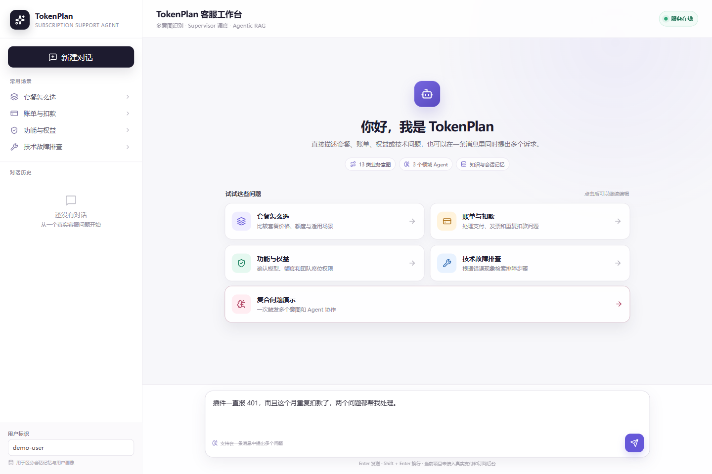
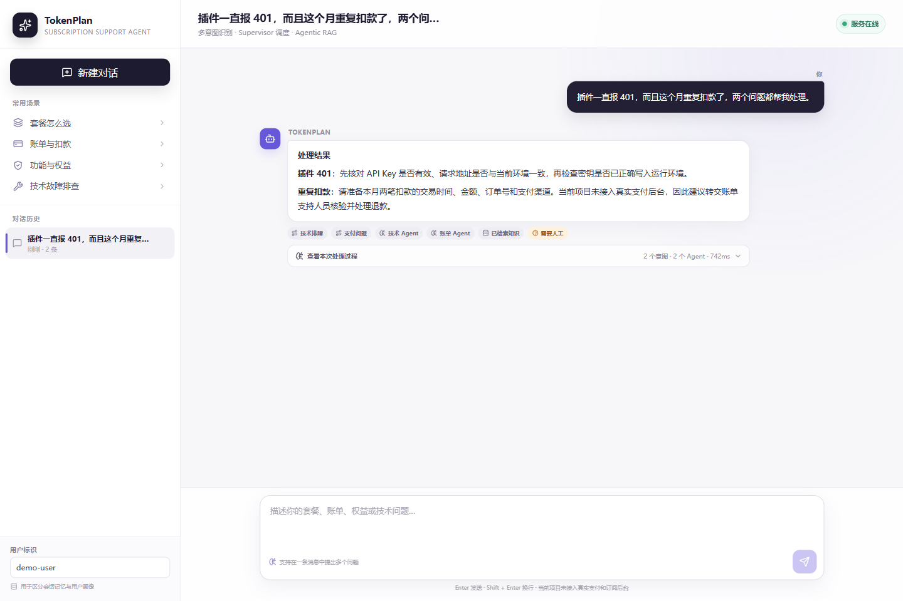
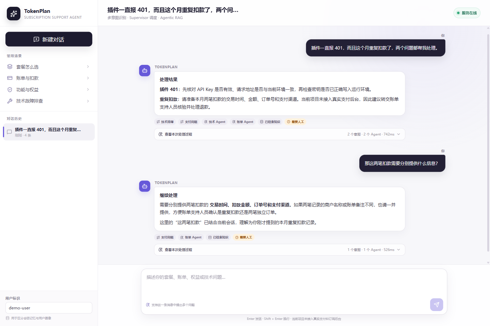
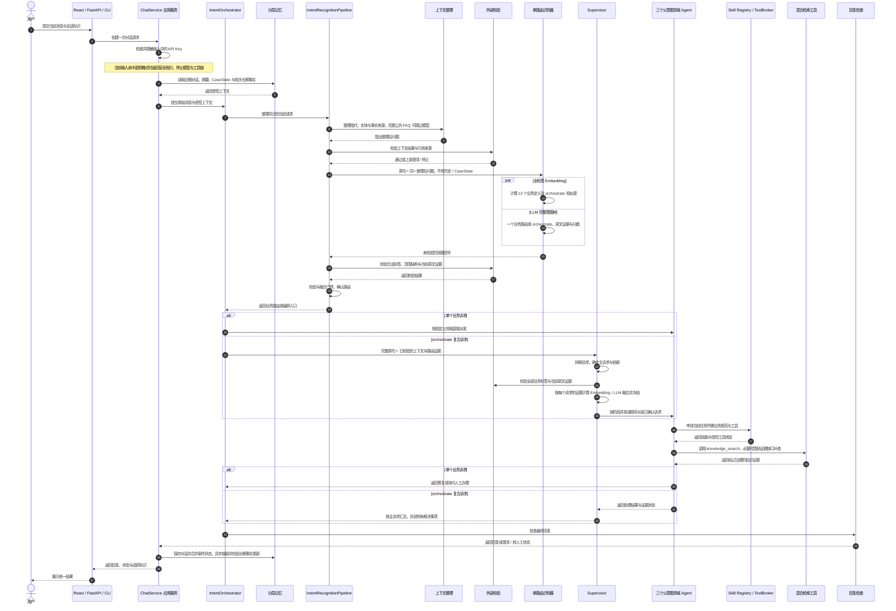

<div align="center">
  <h2>TokenPlan 订阅服务智能体</h2>

  <p>
    <a href="https://github.com/Tassel9/TokenPlan/stargazers"></a>
    
    
    
    
    
  </p>

  <p>面向 AI Coding 订阅用户的 <strong>Supervisor Multi-Agent</strong> 客服系统。</p>
  <p>在一个对话入口中理解订阅客服诉求：单诉求直接交给领域咨询 Agent，复合诉求由 Supervisor 拆解并协调，最终生成一份统一回复。</p>
</div>

## 项目解决什么问题

订阅客服请求通常不是一个孤立的分类问题：用户可能在同一条消息里同时咨询套餐和扣款，也可能用“第二个”“还是刚才那笔”延续前文；回答依据又分散在套餐规则、账单政策和技术文档中。TokenPlan 将这些问题收敛到一条可追踪的处理链路：

- 理解一条消息中仍然成立的多个诉求，并区分否定、举例和背景描述。
- 按套餐与权益、交易与账务、用户支持三个父意图分派诉求；领域 Agent 使用 Agentic RAG，在混合检索后判断证据，根据缺口有限补查。
- 从受治理的业务知识中检索回答依据，证据不足时澄清或转人工，而不是补造结论。
- 延续近期对话、案件状态和稳定用户信息，支持跨轮指代与处理进度衔接。
- 限制每个任务可加载的业务规范和工具范围，保留执行记录便于排查。

当前公开版本主要覆盖套餐与权益咨询、规则解释、账户安全指引、账单流程说明和技术排障。要求代购、提交退款或修改账户时，先说明咨询职责边界并询问是否需要转人工；同时有可回答的咨询时先回答咨询。用户确认后进入现有人工请求流程，不会宣称已经执行业务操作。

## 项目预览

**复合客服问题输入**



用户可以直接描述套餐、账单、权益或技术问题，也可以在一条消息中同时提出多个诉求，不需要预先选择业务入口。

**多诉求协作与统一回复**



系统确认单个业务路由或复合诉求入口，再按套餐与权益、交易与账务、用户支持三个父意图分派；复合诉求由 Supervisor 汇总成一份连贯答复。

**多轮上下文追问**



用户可以沿用“第二个”“这两笔扣款”等表达继续追问，系统结合已有对话和案件状态理解当前所指对象。

## 请求处理主线



独立诉求可以在同一阶段并发处理并等待收敛后汇总；存在前后依赖时按阶段推进。关键前置步骤失败后，下游依赖任务不会继续执行，系统转为澄清或人工处理，并在执行记录中保留本阶段结果。

上下文整理使用来源编号，代码从受控来源回填原文后再校验；识别器使用当前消息的片段编号回填路由证据。对话历史优先保留用户描述，讨论对象保存在案件状态中，即使上一轮因低置信度未派发，也可为后续追问提供上下文。讨论内容不等于已核验的个人业务记录。

## 核心能力

订阅客服通常围绕当前诉求展开，也可能出现相关复合请求、多轮指代、规则分散和敏感操作。TokenPlan 保留这些处理能力，但不预设复合请求占真实流量的比例。

### 🧭 单路由识别与复合诉求编排

先整理上下文，再识别、校验和调度：Embedding 与 LLM 意图树对同一整理后问题并行计算，识别器只输出一个业务路由或 `orchestrate`。普通诉求直接交给对应领域 Agent；复合诉求交给 Supervisor 拆解、确定主次和依赖，再按每个诉求的原文证据做融合校验。

- 职责分离 — RoutingIntentRecognizer 选择唯一入口，不输出子任务列表；`orchestrate` 是控制路由，业务标签仍为 13 个。
- 主次明确 — Supervisor 记录 `primary_intent_id`：用户明确强调时遵从其重点，否则按当前诉求在原文中的顺序选择。置信度只用于校验，不能代替重要程度。
- 逐项校验 — 拆出的每项诉求使用自己的原文证据计算 Embedding，与该项 LLM 分数融合。独立的不确定事项单独澄清，其他已确认事项继续回答；不确定的前置事项会阻止后续依赖。
- 门禁与澄清 — 融合分是放行依据，不是正确概率；范围、来源或分数未通过时，结合已有问题追问缺失信息，避免反复询问用户已经说明的故障。
- 职责边界 — 领域 Agent 回答咨询、检索知识及查询受控只读记录；代购、退款提交、退订或修改账户的要求需询问是否由人工办理，不宣称已经操作或转接。

接口见[上下文、识别、校验分离](docs/intent-context-boundaries.md)，路由改造的初始结果见[离线评测](docs/orchestrate-routing-evaluation-20261004.md)，后续多轮上下文、引用与边界修复见[2026-10-04 修复评测](docs/context-repairs-evaluation-20261004.md)。

### 🔍 Agentic RAG：证据反思与有限补查

三个领域 Agent 通过 `knowledge_search` 检索公开知识，取证后由 Agent 判断证据是否充分，再决定补查、作答、澄清或询问是否转人工。每次检索固定执行向量与 BM25 / SQLite FTS5 混合召回、RRF 融合和 BGE 重排，返回带来源的证据。混合检索负责召回，Agent 负责取证后的决策闭环。

- 首轮取证 — 默认在模型决策前检索，单句使用原执行 Query，多子句最多拆成三路。
- 证据判断 — 当前领域 Agent 提交 `retrieval_reflection`，引用模型可见证据，判断相关性、完整性与具体缺口。
- 有限补查 — 有明确可检索缺口时，使用同一个工具生成不重复的查询；预算为首轮真实调用数加一次补查，重复查询、无效引用和超预算调用由 Runtime 拦截。
- 个人状态边界 — 默认只提供公开知识检索；个人订单、扣款、退款、套餐和权益状态需后台或人工核验，公开规则不能代替个人记录。
- 证据不足 — 保留不确定性，澄清缺失信息或询问是否转人工，不声称查询或办理已完成。

默认应用仅提供这一检索出口，取证后的动作由领域 Agent 决定。查询与执行预算由代码限制，证据含义及答案仍由模型判断；详细边界见[Agentic RAG 说明](docs/hybrid-rag.md)。恢复后尚未重新完成端到端效果评测，不宣称整体降本或质量提升。

### 🧠 分层记忆

基于 SQLite 与 ChromaDB 的分层记忆：SQLite 保存短期会话窗口、增量摘要与有界归档，ChromaDB 保存跨会话用户事实。

- 存储分工 — SQLite 保存近期消息、增量摘要、有界原始归档和案件状态，ChromaDB 保存可跨会话复用的稳定用户事实，RabbitMQ 承接长期事实更新任务；业务进度留在 CaseState，稳定偏好留在长期事实。
- 摘要不留缺口 — 近期对话视图按 Token 预算保留全部未摘要轮次，滑出预算的轮次在同一次压缩中并入增量摘要，保证摘要与最近对话之间没有覆盖缺口。
- 会话一次写 — 同一会话由 SQLite 事务和轮次号保护：子 Agent 按任务 ID 登记独立结果，服务层汇总后一次归档消息和 `CaseState`，再在 SQLite 中一次事务更新窗口与摘要。短期窗口缺失或过期时从仍有效的有界归档重建，迟到的旧轮次摘要不能覆盖新轮次；重启后直接复用已有会话文件。
- 跨会话承接 — 用户明确提及“上次那个问题”时，按用户检索近期未解决咨询并读取原会话；订单号或主题唯一匹配后恢复咨询对象，多个候选先澄清，下一轮可回复序号继续。候选随案件过期，历史业务状态需重新查询。详见[实现与验证边界](docs/cross-session-consultations-20261004.md)。
- 讨论对象延续 — CaseState 保留近期用户讨论原文，与业务处理进度分开；明确新主题优先，范围外话题清除旧讨论，助手回复不能成为用户事实证据。
- 事件式长期事实 — 按“单次抽取 → 服务端校验 → 追加事件 → 读取时归并”更新：模型只提出候选，逐字证据与敏感信息校验通过后才写入，历史值不被覆盖；读取时把事件回放成当前有效画像，撤回与过期都不会回退到旧值。
- 注入不留漏检 — 默认全量注入全部当前有效非全局事实（闭集 ≤3 条，与查询无关），把“记住了却没用上”的语义召回漏检降为零。
- 指代消解有边界 — 抽取可附带同会话最近的用户发言消解指代（如“以后就用它了”），但跨轮证据只允许变更或撤回、且操作措辞必须出现在当前消息；助手措辞永远不能成为事实证据。

### 🤝 多 Agent 编排（Supervisor + 三个父意图 Agent）

Supervisor 按意图树父节点分派与收口，领域 Agent 使用混合检索处理本领域诉求，结果统一回传汇总。

- 父意图分工 — `subscription` 覆盖套餐与权益，`billing` 覆盖交易与账务，`support` 覆盖用户支持。运行时校验诉求与接收 Agent 的父意图归属，跨父意图分别派发，同父意图可以合并。
- 咨询边界 — 代购、退款提交、退订和账户修改等诉求先询问是否转人工，三个领域 Agent 都不执行写操作。
- 并发与依赖 — 独立诉求可在同一阶段并发处理并等待收敛后汇总；存在前后依赖时按阶段推进。
- 统一收口 — 关键前置步骤失败后，下游依赖任务不会继续执行，系统转为澄清或人工处理，并在执行记录中保留本阶段结果。

### 🧰 Skill Registry 与渐进式披露

Skill Registry 管理业务 SOP：技能先校验归属，内容渐进式披露，工具按任务绑定。

- 业务 SOP 治理 — Skill Registry 根据 Supervisor 已确认的诉求选择当前领域 Agent 对应的业务技能，并校验 Agent 与技能的归属关系；业务规范绑定后仅提供同一混合检索出口。
- 渐进式披露 — 提示词只注入技能核心契约与资源目录描述符，资源正文按需读取，减少全量注入导致的注意力涣散。
- 任务级工具边界 — ToolBroker 按任务能力创建本次执行可用的工具边界。

### 🛡️ 安全兜底与可观测性

回复在发出前先过一次安全检查，执行过程全链路留痕。

- 回复安全检查 — 最终回复经过安全检查，避免把失败的检索或未执行的操作描述为成功。
- 输入密钥保护 — ChatService 在查询记忆、调用模型和归档前脱敏匹配到的密钥；当前输入命中时，固定提示用户自行撤销并轮换，停止后续模型与工具调用。当前检测覆盖 `sk-` 和 API Key / 密钥赋值格式，不覆盖所有厂商格式或入口之前的日志。
- 全链路留痕 — Execution Trace 与 Prometheus 指标记录请求阶段、Agent 执行、工具调用和兜底状态，便于定位问题。

## 组件职责

| 组件 | 职责 |
| :--- | :--- |
| React 工作台 | 提交问题并展示回复、处理状态与证据摘要 |
| FastAPI / CLI | 负责传输协议、请求校验和入口级保护 |
| ChatService | 统一 HTTP 与 CLI 的单轮应用流程，负责上下文读取、编排调用、状态合并和记忆写入 |
| QueryContextProcessor | 上游整理指代与实体，提出问题改写和来源编号；代码回填原文后交外部校验，不选择意图 |
| RoutingIntentRecognizer | 对整理后的问题并行计算 Embedding / LLM，只输出一个业务路由或 orchestrate |
| 外部校验器 / IntentRecognitionPipeline | 校验上下文、路由证据和分数；复合请求拆解后对每项业务诉求分别校验与融合 |
| Supervisor | 拆解复合请求并记录主诉求，冻结后决定阶段并发、依赖顺序、澄清、人工确认和最终汇总 |
| 领域 Agent | 按套餐与权益、交易与账务、用户支持三个父意图分工，通过 Agentic RAG 检索并判断证据，根据缺口有限补查；业务办理诉求询问是否转人工 |
| Skill Registry / ToolBroker | 管理业务规范、授权边界与任务级工具绑定 |
| RAG 工具 | `knowledge_search`：向量与 BM25 混合召回、RRF 融合、BGE 重排 |
| 分层记忆 | SQLite 维护窗口、摘要、归档、CaseState 与轮次提交，ChromaDB 维护长期稳定事实 |
| 输入密钥保护 / Response Guard / Trace | 脱敏匹配到的密钥、检查最终回复并记录可诊断的执行过程 |

## 评测与证据边界

`tests/` 与 `evaluation/` 用于代码回归和冻结业务用例上的离线验证。离线结果只说明指定代码、配置、模型和数据集下的表现，不代表线上生产效果、服务等级或真实用户流量结论。

本 README 不发布评测分数，也不把历史或其他业务领域的数据当作 TokenPlan 成绩。对外结论应能够追溯到当前 TokenPlan 业务用例、评测配置和生成报告；生产表现需要独立的线上观测证据。

当前检索流程以[混合检索说明](docs/hybrid-rag.md)为准；历史离线对照仅适用于各自记录的版本。新评测数据集、参考答案和原始模型报告仅保存在本地，不随本次同步上传。代码回归、语义识别与端到端回答质量分别验证。

多轮进度承接、隐含对象恢复及只读后台未连接时的能力表述仍有失败案例，详见修复评测中的剩余问题。有限 FAQ 模板内减少模型调用，不代表整体成本下降或回答质量已稳定。

## 技术栈

| 层次 | 技术 | 用途 |
| :--- | :--- | :--- |
| 应用与接口 | Python 3.12、FastAPI、Pydantic、AsyncIO | 应用服务、接口和运行时数据契约 |
| 模型 | DeepSeek、BGE Embedding、BGE Reranker | 语义理解、向量表示与知识排序 |
| Agent 协作 | RoutingIntentRecognizer、Supervisor、三个领域 Agent、Skill Registry、ToolBroker | 单路由识别、复合诉求拆解、父意图分派与结果汇总 |
| 检索 | ChromaDB、SQLite FTS5 | 向量与关键词混合检索 |
| 记忆与异步任务 | SQLite、ChromaDB、RabbitMQ | 短期窗口与摘要、会话归档、长期事实与异步更新 |
| 前端 | React、TypeScript、Vite | 会话工作台与状态展示 |
| 可观测性 | Prometheus、Execution Trace | 运行指标与执行过程记录 |
| 部署 | Docker、Docker Compose、Nginx | 服务编排、健康检查与反向代理 |

## 本地运行

### 环境要求

| 组件 | 要求 | 说明 |
| :--- | :--- | :--- |
| Python | 3.12 | 后端运行环境 |
| Node.js | 22+ | 前端开发与构建 |
| Docker | Compose v2 | 启动 RabbitMQ、ChromaDB 等依赖 |
| DeepSeek API | 可用 Key | LLM 调用 |

### 1. 准备配置

以下后端命令在仓库根目录执行。先创建虚拟环境并安装依赖，再准备本地配置：

```powershell
python -m venv .venv-win
.\.venv-win\Scripts\python.exe -m pip install -r requirements\base.txt
Copy-Item .env.example .env
```

**只有 `DEEPSEEK_API_KEY` 是必填项**，其余变量全部有代码默认值；`.env.example` 里另有一组"本地运行"地址（指向宿主机），容器跑法会被 Compose 覆盖。完整变量清单与默认值见 [docs/configuration.md](docs/configuration.md)。

编辑 `.env` 并设置 `DEEPSEEK_API_KEY`。部署前应替换示例密码；密钥只保存在本地 `.env`，不要提交到仓库。

填完先跑一次配置自检（不构造服务、只读取环境变量并探测端口，依赖未启动时也能运行）：

```powershell
.\.venv-win\Scripts\python.exe backend\cli.py doctor
```

输出 `ok` / `degraded` / `blocked` 三种结论并给出修复建议；`blocked` 时退出码为 1，可直接用于启动脚本。

运行方式不同，基础设施地址也不同：

- **完整 Docker Compose**：Compose 为应用容器注入 RabbitMQ 和 ChromaDB 的容器内地址，SQLite 短期记忆与归档文件保存在 `./data/session`。
- **本地 Python + Docker 基础设施**：Python 进程从宿主机访问 RabbitMQ 和 ChromaDB，SQLite 会话文件由 `SESSION_DB_PATH` 指定。

升级已有数据卷时，TokenPlan 默认会使用新的项目专属知识库集合和 FTS 索引。若要继续读取旧索引，请在启动前通过 `RAG_CHROMA_COLLECTION_NAME` 与 `RAG_LEXICAL_INDEX_PATH` 显式指向原集合和文件，核对数据后再安排迁移。

### 2. 完整 Docker Compose 启动

```powershell
docker compose up --build -d
docker compose ps
Invoke-RestMethod http://localhost:8000/health
```

API 文档默认位于 `http://localhost:8000/docs`，Nginx 入口默认位于 `http://localhost`。

### 3. 本地 Python 启动

先启动基础设施：

```powershell
docker compose up -d rabbitmq chromadb
```

确认 `.env` 使用宿主机可访问的 RabbitMQ 和 ChromaDB 地址，并保证连接凭据与服务配置一致。完成第 1 步的环境准备后，启动后端：

```powershell
.\.venv-win\Scripts\python.exe -m uvicorn --app-dir backend api.main:app --host 0.0.0.0 --port 8000
```

另开终端发送一条多诉求请求：

```powershell
.\.venv-win\Scripts\python.exe backend\cli.py "插件一直报 401，而且这个月重复扣款了"
```

CLI 用于本地单进程调试；HTTP 接口通过 SQLite 会话锁防止同一会话并发提交。

### 4. 启动前端

后端启动后，另开一个终端：

```powershell
Set-Location frontend
npm ci
npm run dev
```

浏览器访问 `http://127.0.0.1:5173`。开发服务器会把 `/api` 请求代理到 `http://127.0.0.1:8000`；详细配置见 [frontend/README.md](frontend/README.md)。

## 目录结构

```text
TokenPlan
├── backend/      # Python 后端源码
│   ├── application/、agents/、core/   # 应用编排、Supervisor 与语义识别
│   ├── runtime/、response/、skills/   # 受控执行、回复治理与业务 SOP
│   ├── mcp/、memory/                  # 工具、知识检索与分层记忆
│   └── api/、monitor/、tools/         # 接口、可观测性与通用扩展
├── evaluation/   # 离线评测工具与冻结用例
├── tests/        # 自动化测试
└── frontend/     # React 会话工作台
```

后端子模块职责见 [`backend/README.md`](backend/README.md)。

## 本地回归

```powershell
.\.venv-win\Scripts\python.exe -m pip install -r requirements-test.txt
.\.venv-win\Scripts\python.exe -X utf8 -m pytest -q

Push-Location frontend
npm test
npm run build
Pop-Location
```

SQLite 存储回归使用隔离的内存库与临时文件，覆盖窗口与摘要的事务更新、版本校验、TTL、重启恢复和轮次提交；无需额外启动缓存服务。
